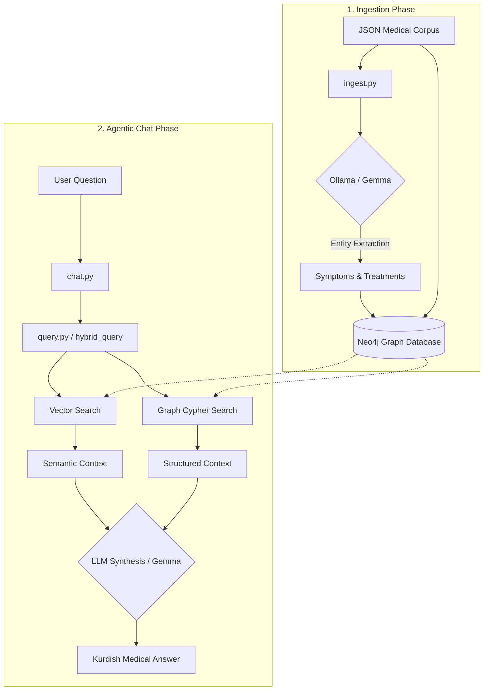

# Kurdish Medical GraphRAG System

A powerful, local Graph-based Retrieval-Augmented Generation (GraphRAG) system designed specifically for the **Central Kurdish (Sorani)** medical domain. This system combines the structured knowledge of a Graph Database (Neo4j) with the semantic power of Vector Search and Large Language Models (Ollama/Gemma).

---

## 🚀 Overview

This project implements a hybrid retrieval system that can answer medical questions in Kurdish by combining the structured knowledge of a Graph Database with semantic vector search.

### System Flowchart



---

## 🛠 Prerequisites

Before running the project, ensure you have the following installed:

### 1. Neo4j (via Docker)
Run Neo4j with the APOC plugin enabled:
```bash
docker run \
    --name neo4j-medical \
    -p 7474:7474 -p 7687:7687 \
    -d \
    -e NEO4J_AUTH=neo4j/password \
    -e NEO4J_PLUGINS='["apoc"]' \
    neo4j:latest
```

### 2. Ollama
Download Ollama from [ollama.com](https://ollama.com) and pull the models:
```bash
ollama pull gemma4:26b
ollama pull nomic-embed-text
```

### 3. Python Environment
```bash
python -m venv venv
source venv/bin/activate  # Windows: venv\Scripts\activate
pip install -r requirements.txt
```

---

## 📂 Project Structure

- `ingest.py`: Processes the `kurdish_medical_corpus_kmc.json` file and builds the Neo4j graph.
- `query.py`: Contains the logic for Hybrid Search (Vector + Graph).
- `chat.py`: **(New)** Interactive terminal interface for chatting with the AI.
- `kurdish_medical_corpus_kmc.json`: The raw dataset.
- `.env`: Configuration for Neo4j and Ollama.

---

## 📖 How to Use

### Step 1: Data Ingestion
Populate your database by running the ingestion script. By default, it processes the first 100 items for testing.
```bash
python ingest.py
```

### Step 2: Interactive Chat (Terminal Interface)
Launch the agentic terminal interface to ask questions:
```bash
python chat.py
```

---

## 🧠 How it Works (Under the Hood)

### 1. The Knowledge Graph
The system builds a graph with the following schema:
- **Nodes**: `Document`, `Instruction`, `Response`, `Symptom`, `Treatment`.
- **Relationships**: 
  - `(Instruction)-[:RESULTED_IN]->(Response)`
  - `(Response)-[:EXTRACTED_FROM]->(Document)`
  - `(Response)-[:MENTIONS_SYMPTOM]->(Symptom)`
  - `(Response)-[:HAS_TREATMENT]->(Treatment)`

### 2. Hybrid Retrieval
When you ask a question like *"نیشانەکانی ئەنفلۆنزا چیین؟"* (What are the symptoms of influenza?):
1.  **Vector Search**: Finds the most semantically similar text responses in the database.
2.  **Graph Search**: Generates a Cypher query to find specific Symptoms and Treatments linked to the topic.
3. **Synthesis**: Both sets of context are fed into the LLM. The system is instructed to **Think** (Chain-of-Thought) before generating a comprehensive, accurate answer in Central Kurdish, ensuring much higher quality and medical accuracy.

---

## 🔧 Configuration

Modify the `.env` file to change models or database credentials:
```env
NEO4J_URI=bolt://localhost:7687
NEO4J_USERNAME=neo4j
NEO4J_PASSWORD=password
OLLAMA_MODEL=gemma4:26b
EMBEDDING_MODEL=nomic-embed-text
JSON_FILE=kurdish_medical_corpus_kmc.json
```

---

## 📝 License
This project is for educational and research purposes in the field of Kurdish NLP and Medical AI.
